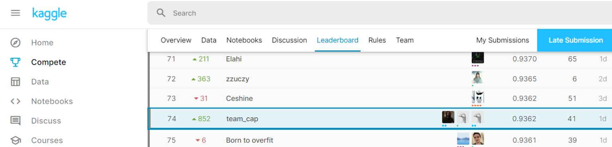

# Bengali.AI Handwritten Grapheme Classification
> Bengali is the 5th most spoken language in the world with hundreds of million of speakers. It’s the official language of Bangladesh and the second most spoken language in India. Considering its reach, there’s significant business and educational interest in developing AI that can optically recognize images of the language handwritten. This challenge hopes to improve on approaches to Bengali recognition.

> Optical character recognition is particularly challenging for Bengali. While Bengali has 49 letters (to be more specific 11 vowels and 38 consonants) in its alphabet, there are also 18 potential diacritics, or accents. This means that there are many more graphemes, or the smallest units in a written language. The added complexity results in ~13,000 different grapheme variations (compared to English’s 250 graphemic units).

> For this competition, the image of a handwritten Bengali grapheme is given and challenge is to separately classify three constituent elements in the image: grapheme root, vowel diacritics, and consonant diacritics.

## Competition Standings
 **SILVER MEDAL WINNING** Trained Model and Inference for Bengali Character Recognition
 

 
 Done By, 
 
  - <a href="https://github.com/Venkateshwar2506">Venkateshwar Raghavan</a>
 
  - <a href="https://github.com/KausikN">RC Vignesh</a>
 
  - <a href="https://github.com/KausikN">Kausik Narayanan</a>
