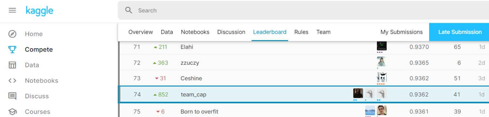

# Bengali.AI Handwritten Grapheme Classification
 Kaggle Competition
 - [Competition](https://www.kaggle.com/competitions/bengaliai-cv19/overview)
 - [Dataset](https://www.kaggle.com/competitions/bengaliai-cv19/data)
 - [Ranking](https://www.kaggle.com/competitions/bengaliai-cv19/leaderboard)

# Competition Standings
 **SILVER MEDAL WINNING** Trained Model and Inference for Bengali Character Recognition
 
 Done By, 
  - <a href="https://github.com/Venkateshwar2506">Venkateshwar Ragavan</a>
  - <a href="https://github.com/Vignesh1399">RC Vignesh</a>
  - <a href="https://github.com/KausikN">Kausik Narayanan</a>